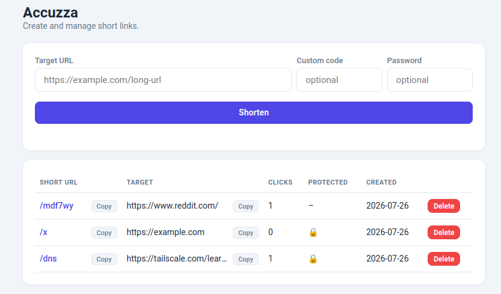

# Accuzza

Minimal URL shortener with master-password protected dashboard, optional per-link passwords, and click tracking.



## Usage

Set the `MASTER_PASSWORD` environment variable in `docker-compose.yaml`, then:

```bash
docker-compose up -d
```

## Features

- Custom short codes (or auto-generated 6-char)
- Optional per-link password protection
- Click counter (successful redirects)
- Public redirect — no auth needed to follow links
